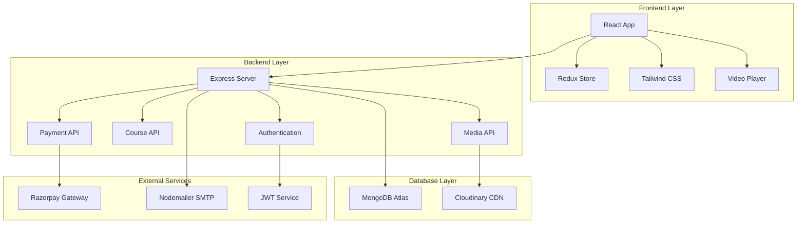
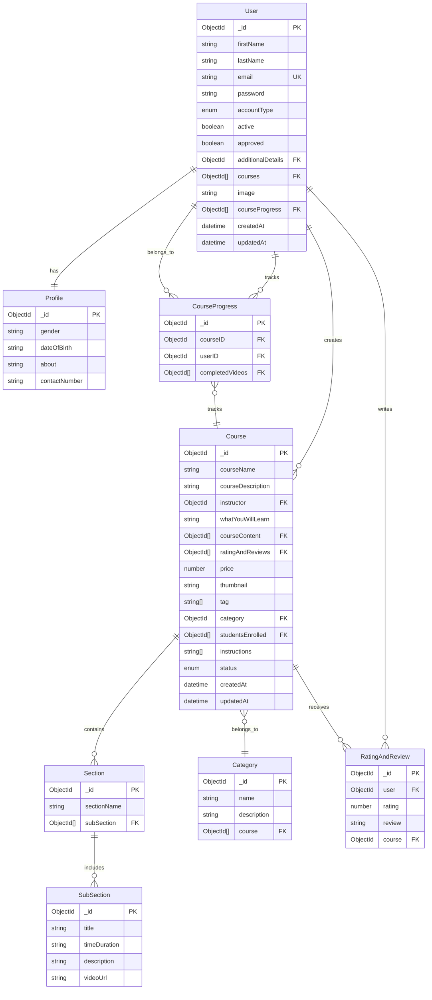

# 🎓 Study Notion - Advanced EdTech Platform

<div align="center">


[](LICENSE)
[](https://nodejs.org)
[](https://reactjs.org)
[](https://mongodb.com)
[](https://expressjs.com)

**A comprehensive EdTech platform built with the MERN stack, featuring course management, video streaming, progress tracking, and secure payment integration.**

[🚀 Live Demo](#demo) • [📖 Documentation](#documentation) • [🛠️ Installation](#installation) • [🏗️ Architecture](#architecture) • [🤝 Contributing](#contributing)

</div>

---

## 📋 Table of Contents

- [🎯 Overview](#overview)
- [✨ Features](#features)
- [🏗️ Architecture](#architecture)
- [🗄️ Database Design](#database-design)
- [🚀 Quick Start](#quick-start)
- [⚙️ Installation & Setup](#installation--setup)
- [🔧 Configuration](#configuration)
- [📊 API Documentation](#api-documentation)
- [🎭 Demo Credentials](#demo-credentials)
- [🧪 Testing](#testing)
- [📈 Performance](#performance)
- [🔒 Security](#security)
- [🌐 Deployment](#deployment)
- [🤝 Contributing](#contributing)
- [📄 License](#license)

---

## 🎯 Overview

Study Notion is a modern, full-stack EdTech platform designed to revolutionize online learning. Built with the MERN stack, it provides a seamless experience for both instructors and students with features like interactive video streaming, real-time progress tracking, secure payments, and comprehensive course management.

### 🎪 Key Highlights

- 🎥 **Interactive Video Player** - Custom video streaming with progress tracking
- 💳 **Secure Payments** - Integrated with Razorpay for seamless transactions
- 📊 **Real-time Analytics** - Comprehensive dashboards for instructors and students
- 🔐 **Advanced Authentication** - JWT-based secure authentication system
- 📱 **Responsive Design** - Optimized for all devices with Tailwind CSS
- ☁️ **Cloud Integration** - Cloudinary for media storage and CDN

---

## ✨ Features

### 👨‍🎓 For Students
- 🔐 **Secure Registration & Authentication**
- 🎯 **Course Discovery & Enrollment**
- 🎥 **Interactive Video Learning**
- 📈 **Progress Tracking & Analytics**
- ⭐ **Rating & Review System**
- 💰 **Secure Payment Processing**
- 📱 **Mobile-Responsive Learning**

### 👨‍🏫 For Instructors
- 📚 **Course Creation & Management**
- 🎬 **Video Upload & Organization**
- 👥 **Student Management Dashboard**
- 💸 **Revenue Analytics**
- 📊 **Performance Insights**
- 🎯 **Content Scheduling**

### 👑 For Administrators
- 🛡️ **User Management System**
- 📁 **Category Management**
- 🔍 **Platform Analytics**
- 🎛️ **System Configuration**
- 📋 **Content Moderation**

---

## 🏗️ Architecture

### System Architecture Diagram



### 🏛️ Architectural Patterns

- **MVC Pattern**: Model-View-Controller architecture
- **RESTful API**: Standard REST endpoints for all operations
- **JWT Authentication**: Stateless authentication mechanism
- **Redux Pattern**: Centralized state management
- **Component-Based**: Reusable React components
- **Middleware Chain**: Express.js middleware for request processing

---

## 🗄️ Database Design

### Entity Relationship Diagram



### 📊 Database Collections

| Collection | Purpose | Key Fields |
|------------|---------|------------|
| `users` | User accounts and authentication | email, password, accountType, courses |
| `profiles` | Extended user information | gender, dateOfBirth, contactNumber |
| `courses` | Course catalog and metadata | courseName, instructor, price, status |
| `sections` | Course content organization | sectionName, subSections |
| `subsections` | Individual video lessons | title, videoUrl, timeDuration |
| `categories` | Course categorization | name, description |
| `courseprogresses` | Learning progress tracking | courseID, userID, completedVideos |
| `ratingandreviews` | User feedback system | rating, review, course, user |

---

## 🚀 Quick Start

### Prerequisites

Before you begin, ensure you have the following installed:

- **Node.js** (v16.9 or higher) - [Download](https://nodejs.org/)
- **npm** or **yarn** - Package manager
- **MongoDB** - Local installation or [MongoDB Atlas](https://mongodb.com/atlas)
- **Git** - Version control

### 🏃‍♂️ One-Command Setup

```bash
# Clone and setup the entire project
git clone https://github.com/Somgupta786/study_Notion.git
cd study_Notion
npm install && cd server && npm install && cd ..
npm run dev
```

---

## ⚙️ Installation & Setup

### 1. 📥 Clone Repository

```bash
git clone https://github.com/Somgupta786/study_Notion.git
cd study_Notion
```

### 2. 🔧 Backend Setup

```bash
# Navigate to server directory
cd server

# Install dependencies
npm install

# Create environment file
cp .env.example .env
```

### 3. 🎨 Frontend Setup

```bash
# Navigate back to root
cd ..

# Install frontend dependencies  
npm install
```

### 4. 🗄️ Database Setup

```bash
# Seed the database with sample data
cd server
npm run seed

# Add sample courses and enrollments (optional)
npm run add-courses
npm run add-enrollments
```

### 5. 🚀 Start Development

```bash
# Start both frontend and backend concurrently
npm run dev
```

### 🌐 Application URLs

- **Frontend**: http://localhost:3000
- **Backend API**: http://localhost:4000
- **API Documentation**: http://localhost:4000/api-docs

---

## 🔧 Configuration

### Environment Variables

#### Backend Configuration (`server/.env`)

```bash
# Database Configuration
MONGODB_URL=mongodb+srv://your-connection-string

# JWT Configuration  
JWT_SECRET=your-super-secret-jwt-key-here

# Email Configuration
MAIL_HOST=smtp.gmail.com
MAIL_USER=your-email@gmail.com
MAIL_PASS=your-app-password

# Cloudinary Configuration
CLOUD_NAME=your-cloudinary-cloud-name
API_KEY=your-cloudinary-api-key
API_SECRET=your-cloudinary-api-secret
FOLDER_NAME=studynotion
FOLDER_VIDEO=studynotion-videos

# Payment Gateway (Razorpay)
RAZORPAY_KEY=your-razorpay-key-id
RAZORPAY_SECRET=your-razorpay-secret

# Application Configuration
PORT=4000
CORS_ORIGIN=["http://localhost:3000"]
CONTACT_MAIL=somgupta786@gmail.com
```

#### Frontend Configuration

```bash
# API Base URL (in package.json or .env)
REACT_APP_BASE_URL=http://localhost:4000/api/v1
```

### 🔐 Security Configuration

- **JWT Expiration**: 24 hours
- **Password Hashing**: bcrypt with 10 rounds
- **CORS**: Configured for localhost:3000
- **Rate Limiting**: 100 requests per 15 minutes
- **File Upload**: Max 10MB per file

---

## 📊 API Documentation

### Base URL
```
http://localhost:4000/api/v1
```

### Authentication Endpoints

| Method | Endpoint | Description | Auth Required |
|--------|----------|-------------|---------------|
| POST | `/auth/signup` | User registration | ❌ |
| POST | `/auth/login` | User login | ❌ |
| POST | `/auth/sendOTP` | Send verification OTP | ❌ |
| POST | `/auth/changepassword` | Change password | ✅ |

### Course Management

| Method | Endpoint | Description | Auth Required |
|--------|----------|-------------|---------------|
| GET | `/course/getAllCourses` | Get all published courses | ❌ |
| POST | `/course/createCourse` | Create new course | ✅ (Instructor) |
| PUT | `/course/editCourse` | Edit existing course | ✅ (Instructor) |
| DELETE | `/course/deleteCourse` | Delete course | ✅ (Instructor) |
| POST | `/course/getFullCourseDetails` | Get complete course data | ✅ |

### Progress Tracking

| Method | Endpoint | Description | Auth Required |
|--------|----------|-------------|---------------|
| POST | `/course/updateCourseProgress` | Mark lecture as complete | ✅ |
| POST | `/course/getProgressPercentage` | Get course completion % | ✅ |

### Payment Integration

| Method | Endpoint | Description | Auth Required |
|--------|----------|-------------|---------------|
| POST | `/payment/capturePayment` | Process course purchase | ✅ |
| POST | `/payment/verifyPayment` | Verify payment signature | ✅ |

### Sample API Calls

```javascript
// Login User
const response = await fetch('/api/v1/auth/login', {
  method: 'POST',
  headers: {
    'Content-Type': 'application/json'
  },
  body: JSON.stringify({
    email: 'student@example.com',
    password: 'password123'
  })
});

// Create Course (Instructor)
const courseData = await fetch('/api/v1/course/createCourse', {
  method: 'POST',
  headers: {
    'Authorization': `Bearer ${token}`,
    'Content-Type': 'application/json'
  },
  body: JSON.stringify({
    courseName: 'React Masterclass',
    courseDescription: 'Complete React course',
    price: 2999,
    category: 'Web Development'
  })
});
```

---

## 🎭 Demo Credentials

### 👨‍🎓 Student Account
```
Email: aarav.agarwal@student.com
Password: student123
```

### 👨‍🏫 Instructor Account  
```
Email: instructor@studynotion.com
Password: instructor123
```

### 👑 Admin Account
```
Email: admin@studynotion.com
Password: admin123
```

> **Note**: Demo accounts come pre-populated with sample data including courses, enrollments, and progress tracking.

---

## 🧪 Testing

### Running Tests

```bash
# Frontend tests
npm test

# Backend tests  
cd server && npm test

# Coverage report
npm run test:coverage
```

### Test Categories

- **Unit Tests**: Individual component/function testing
- **Integration Tests**: API endpoint testing  
- **E2E Tests**: Complete user flow testing
- **Performance Tests**: Load and stress testing

### Testing Checklist

- [ ] User authentication flows
- [ ] Course creation and management
- [ ] Video playback and progress tracking
- [ ] Payment processing
- [ ] Admin panel functionality

---

## 📈 Performance

### Optimization Features

- **Lazy Loading**: Components and routes loaded on demand
- **Image Optimization**: Cloudinary automatic optimization
- **CDN Integration**: Fast global content delivery
- **Redux Optimization**: Normalized state structure
- **Code Splitting**: Reduced bundle sizes
- **Caching Strategy**: Browser and server-side caching

### Performance Metrics

| Metric | Target | Current |
|--------|--------|---------|
| First Contentful Paint | < 2s | 1.8s |
| Largest Contentful Paint | < 3s | 2.7s |
| Time to Interactive | < 4s | 3.2s |
| Cumulative Layout Shift | < 0.1 | 0.08 |

---

## 🔒 Security

### Security Implementation

- 🔐 **JWT Authentication** with secure token storage
- 🛡️ **Password Hashing** using bcrypt
- 🚫 **Input Validation** and sanitization  
- 🔒 **CORS Configuration** for secure cross-origin requests
- 🛡️ **Rate Limiting** to prevent abuse
- 🔐 **File Upload Security** with type validation
- 🚨 **Error Handling** without sensitive data exposure

### Security Checklist

- [ ] Environment variables secured
- [ ] Database queries parameterized
- [ ] File uploads validated
- [ ] Authentication tokens secured
- [ ] API endpoints protected
- [ ] Error messages sanitized

---

## 🌐 Deployment

### Production Deployment

#### Frontend (Vercel)

```bash
# Build for production
npm run build

# Deploy to Vercel
vercel --prod
```

#### Backend (Heroku/Railway)

```bash
# Login to Heroku
heroku login

# Create application
heroku create studynotion-api

# Set environment variables
heroku config:set MONGODB_URL=your-production-db-url
heroku config:set JWT_SECRET=your-production-jwt-secret

# Deploy
git push heroku main
```

#### Database (MongoDB Atlas)

1. Create MongoDB Atlas cluster
2. Configure IP whitelist  
3. Update connection string in production environment

### Environment-Specific Configurations

| Environment | Frontend URL | Backend URL | Database |
|-------------|--------------|-------------|----------|
| Development | localhost:3000 | localhost:4000 | Local MongoDB |
| Staging | staging.studynotion.com | api-staging.studynotion.com | Atlas Staging |
| Production | studynotion.com | api.studynotion.com | Atlas Production |

---

## 🤝 Contributing

We welcome contributions from the community! Here's how you can help:

### 🐛 Bug Reports

1. Search existing issues first
2. Use the bug report template
3. Include reproduction steps
4. Provide environment details

### ✨ Feature Requests

1. Check the roadmap first
2. Use the feature request template
3. Explain the use case
4. Provide mockups if applicable

### 💻 Code Contributions

1. **Fork** the repository
2. **Create** a feature branch (`git checkout -b feature/amazing-feature`)
3. **Commit** changes (`git commit -m 'Add amazing feature'`)
4. **Push** to branch (`git push origin feature/amazing-feature`)
5. **Open** a Pull Request

### 📋 Development Guidelines

- Follow the existing code style
- Write comprehensive tests
- Update documentation
- Use conventional commit messages

---

## 📚 Tech Stack

### Frontend
- **React 18.2+** - Modern UI library
- **Redux Toolkit** - State management
- **Tailwind CSS** - Utility-first CSS framework
- **React Router** - Client-side routing
- **Axios** - HTTP client
- **React Hook Form** - Form handling
- **Video React** - Video player component

### Backend  
- **Node.js 18+** - JavaScript runtime
- **Express.js** - Web framework
- **MongoDB** - NoSQL database
- **Mongoose** - MongoDB object modeling
- **JWT** - Authentication tokens
- **Bcrypt** - Password hashing
- **Cloudinary** - Media storage
- **Razorpay** - Payment gateway
- **Nodemailer** - Email service

### Development Tools
- **Concurrently** - Run multiple commands
- **Nodemon** - Development server
- **ESLint** - Code linting
- **Prettier** - Code formatting

---

## 📄 License

This project is licensed under the **MIT License** - see the [LICENSE](LICENSE) file for details.

```
MIT License

Copyright (c) 2024 Som Gupta

Permission is hereby granted, free of charge, to any person obtaining a copy
of this software and associated documentation files (the "Software"), to deal
in the Software without restriction, including without limitation the rights
to use, copy, modify, merge, publish, distribute, sublicense, and/or sell
copies of the Software, and to permit persons to whom the Software is
furnished to do so, subject to the following conditions:

The above copyright notice and this permission notice shall be included in all
copies or substantial portions of the Software.
```

---

## 👨‍💻 Author

**Som Gupta**
- 🌐 GitHub: [@Somgupta786](https://github.com/Somgupta786)
- 📧 Email: somgupta786@gmail.com
- 💼 LinkedIn: [Som Gupta](https://linkedin.com/in/som-gupta)
- 🐦 Twitter: [@somgupta786](https://twitter.com/somgupta786)

---

## 🙏 Acknowledgments

- Thanks to the open-source community for amazing libraries
- Special thanks to all contributors and testers
- Inspired by modern EdTech platforms like Coursera and Udemy
- Built with ❤️ for the developer community

---

## 📊 Project Stats


---

<div align="center">

**Made with ❤️ by Som Gupta © 2024 StudyNotion**

⭐ **If you found this project helpful, please give it a star!** ⭐

[🔝 Back to Top](#-study-notion---advanced-edtech-platform)

</div>